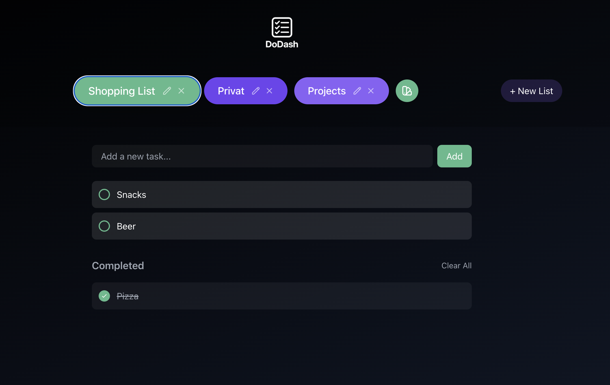

# DoDash


A modern, elegant to-do list app for your home or office—**no login, no cloud, just you and your tasks**. DoDash offers a beautiful dark mode UI, multiple color-coded lists, and a seamless experience on both desktop and mobile.

<div align="center">
  
</div>

---

## ✨ Features

- **Multiple Lists:** Create, edit, and delete unlimited to-do lists
- **Custom Colors:** Choose a unique color for each list (with color picker)
- **Dark Mode:** Always-on, elegant dark theme with soft gradients
- **Drag & Drop:** Reorder tasks within lists by drag & drop
- **Task Completion:** Mark tasks done, see them grayed out and strikethrough
- **Clear Completed:** One-click to clear all completed tasks
- **Instant Sync:** Real-time UI updates and auto-save
- **Responsive Design:** Looks perfect on desktop, tablet, and phone
- **No Accounts, No Cloud:** 100% local, for your personal or family use
- **Dockerized:** Runs in a single container, accessible via your LAN

---

## 🛠️ Tech Stack

**Frontend:**  
- [React 18](https://react.dev/) (with Hooks, Functional Components)
- [TypeScript](https://www.typescriptlang.org/) (strict typing)
- [TailwindCSS](https://tailwindcss.com/) (utility-first styling)
- [React Beautiful DnD](https://github.com/atlassian/react-beautiful-dnd) (drag & drop)
- [React Colorful](https://omgovich.github.io/react-colorful/) (color picker)
- [Heroicons](https://heroicons.com/) (SVG icons)

**Backend:**  
- [Node.js](https://nodejs.org/) + [Express](https://expressjs.com/) (API, static serving)
- **Data Storage:** Simple JSON file (no database, no browser cache)
- **Container:** [Docker](https://www.docker.com/) for easy deployment

---

## 📂 Project Structure

```
dodash/
├── src/           # Frontend source code
│   ├── components/
│   │   ├── AddListButton
│   │   ├── ListSelector
│   │   ├── TaskItem
│   │   └── TaskList
│   ├── types/
│   ├── App.tsx
│   └── index.tsx
├── server/        # Backend code (Express)
│   └── index.js
├── public/        # Static assets
├── data/          # JSON data persistence
│   └── todos.json
└── docker/        # Docker config
```

---

## 🚀 Quick Start

### 1. **Clone the Repository**
```bash
git clone https://github.com/yourusername/dodash.git
cd dodash
```

### 2. **Install Dependencies**
```bash
npm install
```

### 3. **Start in Development**
- **Backend:**  
  `npm run server`
- **Frontend:** *(in a new terminal)*  
  `npm run dev`

App runs at: [http://localhost:3000](http://localhost:3000)

---

## 🐳 Production: Docker Deployment

### 1. **Build the Frontend**
```bash
npm run build
```

### 2. **Build Docker Image**
```bash
docker build -t dodash .
```

### 3. **Run Docker Container**
```bash
docker run -p 8080:8080 -v $(pwd)/data:/app/data dodash
```

Access DoDash at [http://localhost:8080](http://localhost:8080) or your local network IP (e.g., `http://192.168.1.10:8080`).

---

## 💾 Data Storage & Persistence

- All data is stored in `/app/data/todos.json` inside the container.
- Data is **persisted** via Docker volume, safe across restarts.
- **Backup:** Copy the `data/` folder to save your lists/tasks.

**JSON structure:**
```json
{
  "lists": [
    {
      "id": "string",
      "name": "string",
      "color": "string (hex)",
      "tasks": [
        {
          "id": "string",
          "text": "string",
          "completed": "boolean"
        }
      ]
    }
  ]
}
```

---

## 🌍 Browser Support

- Chrome / Edge (latest 2 versions)
- Firefox (latest 2 versions)
- Safari (latest 2 versions)
- Mobile browsers (iOS, Android)

---

## 🤝 Contributing

Contributions are welcome! Open an issue or submit a PR—feedback and improvements are appreciated.

---

## 📄 License

[MIT License](LICENSE)

---

**Ready to get things done?**  
Star the repo, run DoDash in your LAN, and enjoy next-level productivity—*beautifully simple, 100% yours.*

---

**Tipp:**  
Nach dem Push zu GitHub kannst du die [Repository Description] und das `topics`-Feld im GitHub-Repo noch ausfüllen für bessere Auffindbarkeit.  
Wenn du willst, helfe ich auch gern noch beim ersten Push oder mit einer hübschen Repository-Beschreibung auf GitHub! Sag einfach Bescheid.
